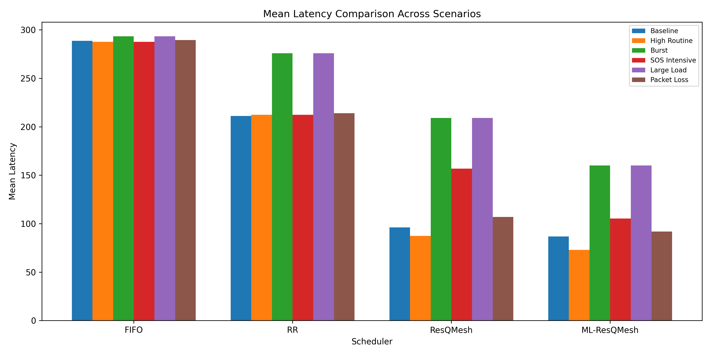
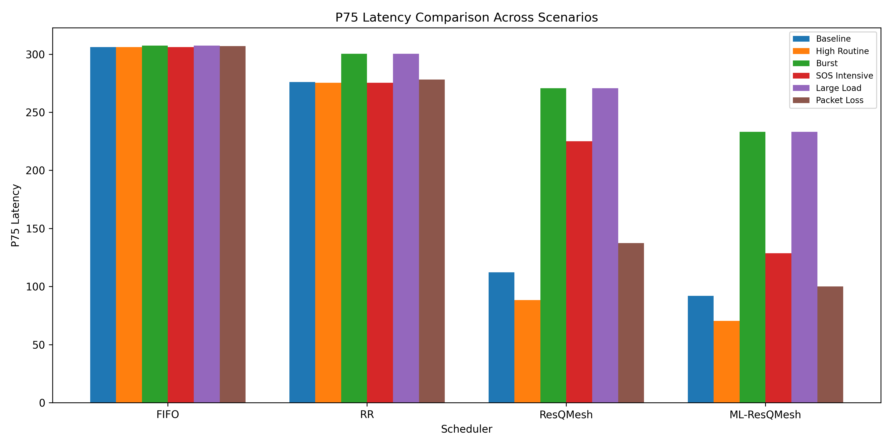
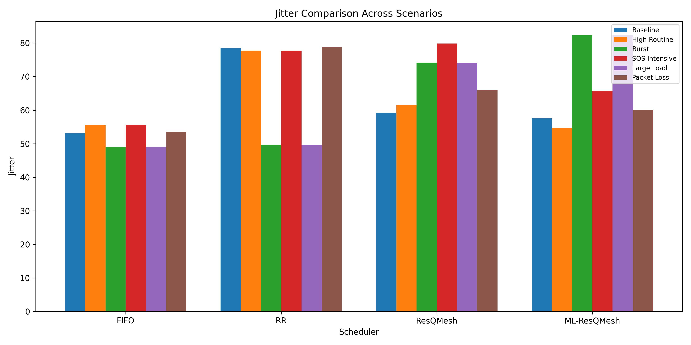
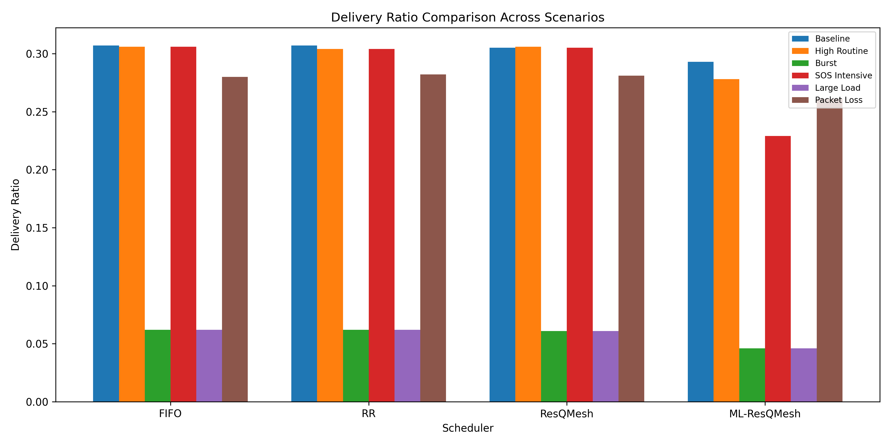

# Journal_paper
## ResQMesh: Urgency-Aware Scheduling for LoRa Mesh Networks

## Overview

ResQMesh is a lightweight urgency-aware scheduling framework designed for LoRa mesh networks in disaster communication scenarios. Traditional schedulers such as FIFO and Round Robin treat all messages equally, leading to delays in critical alerts.

This project introduces a heuristic-based scheduling mechanism that prioritizes messages based on urgency, along with an optional machine learning component for delay prediction.


## Key Features

* Urgency-aware scheduling using heuristic scoring
* Congestion-aware prioritization
* Multi-hop LoRa mesh simulation
* ML-based delay risk prediction (Decision Tree)
* Comparative evaluation with FIFO and Round Robin
* Simulation across multiple disaster scenarios

---

## System Architecture

The system consists of:

1. Message generation at nodes
2. Queue-based scheduling
3. Urgency score computation
4. Transmission over multi-hop network
5. Optional ML-based delay prediction

---

## Urgency Function

The urgency score is computed as:

U = w1 * Tm + w2 * Cm + w3 * Sm

Where:

* Tm → Time in queue
* Cm → Message criticality
* Sm → Queue congestion ratio

---

## Machine Learning Component

* Model: Decision Tree Classifier
* Features: Cm, Sm, hop count
* Task: Predict high-delay risk messages
* Used to enhance scheduling decisions (ML-boost variant)


## Project Structure


├── data.py        # Dataset generation from simulation
├── scheduler.py   # Simulation with multiple schedulers
├── ml_model.py    # ML training and evaluation
├── plot.py        # Visualization of results
├── dataset.csv    # Generated dataset
```

---

##  Results Summary

### Mean Latency


### P75 Latency


### Jitter


### Delivery Ratio


| Scheduler     | Mean Latency | P75 Latency | Jitter | Delivery Ratio |
| ------------- | ------------ | ----------- | ------ | -------------- |
| FIFO          | 287.68       | 306.05      | 54.91  | 0.308          |
| Round Robin   | 210.92       | 275.27      | 78.39  | 0.309          |
| ResQMesh      | 93.90        | 106.86      | 58.35  | 0.305          |
| ResQMesh + ML | 85.87        | 91.03       | 57.56  | 0.297          |

---

##  How to Run

### 1. Generate Dataset

```bash
python data.py
```

### 2. Train ML Model

```bash
python ml_model.py
```

### 3. Run Simulation

```bash
python scheduler.py
```

### 4. Plot Results

```bash
python plot.py
```

---

## Simulation Details

* Nodes: 50
* Simulation Time: 2000–4000 ticks
* Max Queue Size: 100
* Multi-hop range: 1–7 hops
* Includes:

  * Channel noise
  * Congestion spikes
  * Retransmissions

---


## Applications

* Disaster communication systems
* Emergency response networks
* IoT-based low-power networks
* Delay-sensitive distributed systems

---

## Future Improvements

* Integration with real LoRa hardware
* Advanced ML models (Random Forest, XGBoost)
* Real-time deployment optimization
* Adaptive weight tuning

---

## Author

Moniish Mohan Srinivasan
B.Tech CSE, VIT Chennai

---
